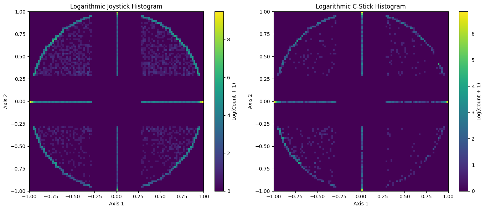

## Inputs
We have a mix of binary and semi-continuous data.

### The Analog Inputs
The analog sticks take values between $[-1, -0.2875]\cup\{0\}\cup[0.2875, 1]$ in increments of .0125. There is a deadzone around 0. The values are not uniformly distributed, there is more values at the edges of the circle. The distribution of the values is shown below (we remove the (0,0) value so that the other values show up on the plots).

We transform the analog inputs in the TrainingDataset class to evenly spaced in the interval $[-1, 1]$.
```python
# Shift inputs closer to 0, respecting the increments of .0125
analog_transformed[analog_transformed > 0] -= 0.2875 + 0.0125
analog_transformed[analog_transformed < 0] += 0.2875 - 0.0125
# Scale inputs to be between -.5 and .5
analog_transformed *= .5 / .725
# Add .5 to so final inputs are between 0 and 1
analog_transformed += .5
```
When we asses the model's performance, we care that the model gets within the bins of the analog inputs or how many bins we are away from the target.
```python
integer_stick_targets = np.round(target[:,0:4] / 0.008620689655172415 ).astype(np.int32)
integer_stick_pred = np.round(pred[:,0:4] / 0.008620689655172415).astype(np.int32)
```
As an example, here we have a table that shows the percent of frames the model was within n bins of the target.
| How Close | JSTICK_X   | JSTICK_Y   | CSTICK_X   | CSTICK_Y   |
|-----------|------------|------------|------------|------------|
| 0         | 21.846934  | 30.849162  | 63.738467  | 53.315810  |
| 1         | 38.235865  | 51.514800  | 87.480318  | 82.347296  |
| 2         | 47.925924  | 59.925596  | 92.453506  | 89.021015  |
| 3         | 55.149839  | 65.521103  | 94.542510  | 91.803883  |
| 4         | 60.622391  | 69.701577  | 95.611314  | 93.420068  |
| 5         | 64.945117  | 73.027633  | 96.227636  | 94.466899  |
| 6         | 68.510912  | 75.825144  | 96.615769  | 95.182737  |
| 7         | 71.553068  | 78.244224  | 96.876054  | 95.696722  |
| 8         | 74.206838  | 80.364655  | 97.060998  | 96.083443  |
| 9         | 76.563239  | 82.240707  | 97.198743  | 96.383779  |

We did try adding additional binary features corresponding to when the analog inputs were 0. This did not improve the model's performance **SHOULD CHECK THIS**
### The Digital Inputs
The digital inputs are binary. We care that the model gets the correct value for these inputs.

 The buttons values are 0 (inactive) far more often than they are 1 (active).
| Button | Active Frames |
|-------|-------------------------------|
| TRIGGER_LOGICAL | 16.9% **(check)** |
| Z | 0.9% |
| A | 6.1% |
| B | 4.59% |
| X_or_Y | 9.7% |

The model's accuracy when the button was not pressed was higher than when the button was pressed.
| Button           | Accuracy   | Acc of 0   | Acc of 1   |
|------------------|------------|------------|------------|
| TRIGGER_LOGICAL  | 88.519695  | 90.179586  | 95.243926  |
| Z                | 98.780531  | 98.769754  | 99.966871  |
| A                | 93.515164  | 93.133870  | 99.312793  |
| B                | 95.820327  | 95.658194  | 99.278211  |
| X_or_Y           | 87.057540  | 86.287204  | 94.053059  |

We tried a weighted binary cross entropy loss to see if this would improve the model's performance **(SHOULD CHECK THIS AGAIN)**.


### The loss function
We tried a variety of different loss functions. The simplest used mean squared error for the analog inputs and binary cross entropy for the binary inputs. 
```python
class CustomLoss(nn.Module):
    def __init__(self):
        super(CustomLoss, self).__init__()
        self.BCE = nn.BCEWithLogitsLoss(reduction='sum')  # Consider using weighted BCE if needed
        self.MSE = nn.MSELoss(reduction='sum')
        
    def forward(self, pred, target):
        # Calculating losses
        mse_loss = self.MSE(torch.sigmoid(pred[:,0:4,0:60]), target[:,0:4,0:60]) 
        bce_loss = self.BCE(pred[:,4:,0:60], target[:,4:,0:60])
        
        # Total loss, we divide the bce loss by 100 to make it comparable to the mse loss
        return mse_loss  + bce_loss / 100
```
Depending on how much we scale the binary cross entropy loss, the model will prioritize the analog or binary inputs. 

**should try a weighted binary cross entropy loss**

## Training
- For some reason, the model did not train when we used autocast. (I think that ``anomaly_detection_minute/convolutional_autoencoder_train_test.ipynb`` is the best version of the train_model function. The one in autoencoder_improvement uses autocast)

---

Below are two tables to help you interpret **Binary Cross-Entropy (BCE)** loss in terms of approximate accuracy and what constitutes a "good" score for BCE in different contexts.

---

## **Table 1: Approximate BCE Loss to Accuracy Conversion**
The relationship between BCE and accuracy depends on how well the model differentiates between positive and negative classes. While these values can vary based on data distribution, below is a general mapping:

| **BCE Loss** | **Approximate Accuracy (%)** | **Interpretation**                  |
|--------------|-------------------------------|-------------------------------------|
| 0.69         | 50%                          | Random guessing (e.g., balanced binary classes) |
| 0.50         | 70%                          | Slightly better than random         |
| 0.30         | 85%                          | Good prediction capability          |
| 0.15         | 93%                          | Excellent prediction capability     |
| 0.05         | 98%                          | Almost perfect                      |
| 0.01         | ~99.9%                       | Near flawless prediction            |

### Notes:
1. **Loss and accuracy are not perfectly linear**: BCE measures how confident the model is in its predictions, while accuracy simply measures the fraction of correct predictions. Small BCE loss does not always imply perfect accuracy, especially for imbalanced datasets.
2. **Threshold Assumption**: The accuracy assumes a threshold of 0.5 to classify outputs as positive/negative.

---

## **Table 2: What Is a "Good" BCE Score?**
What qualifies as a "good" BCE loss depends heavily on the context of the task, the dataset, and whether your data is balanced or imbalanced. Here's a guide:

| **BCE Loss Range** | **Context/Interpretation**              | **Example**                    |
|---------------------|-----------------------------------------|---------------------------------|
| **0.69+**           | Random guessing; model not learning.   | Imbalanced dataset without weighting or a naive model. |
| **0.5 - 0.69**      | Slightly better than random.           | Early training or poorly tuned model. |
| **0.3 - 0.5**       | Decent; learning useful patterns.      | Baseline for balanced binary classification tasks. |
| **0.1 - 0.3**       | Good; strong predictive performance.   | Typical for well-trained models on balanced datasets. |
| **< 0.1**           | Excellent; near-perfect classification.| Highly confident predictions on well-modeled data. |
| **< 0.01**          | Overfitting or trivial task.           | Could indicate model memorizing training data. |

### Notes:
1. **Balanced vs. Imbalanced Datasets**:
   - On **balanced datasets**, a BCE of ~0.3 or below is generally good.
   - On **imbalanced datasets**, a low BCE may indicate the model is simply predicting the majority class. In such cases, consider weighted BCE loss or metrics like precision, recall, and F1-score.
2. **Dataset Difficulty**: For harder datasets (e.g., noisy data or highly overlapping classes), a BCE of ~0.4 could still represent excellent performance.

---

## Example Use Case Interpretation
- If your BCE loss stabilizes around **0.2**, you can expect accuracy to be around **90-92%** on a balanced dataset.
- If you see **0.01** BCE loss, double-check for overfitting, especially if the test BCE is much higher than the training BCE.

If you provide specifics about your task (e.g., balanced or imbalanced classes, the dataset type), I can refine the interpretation further!